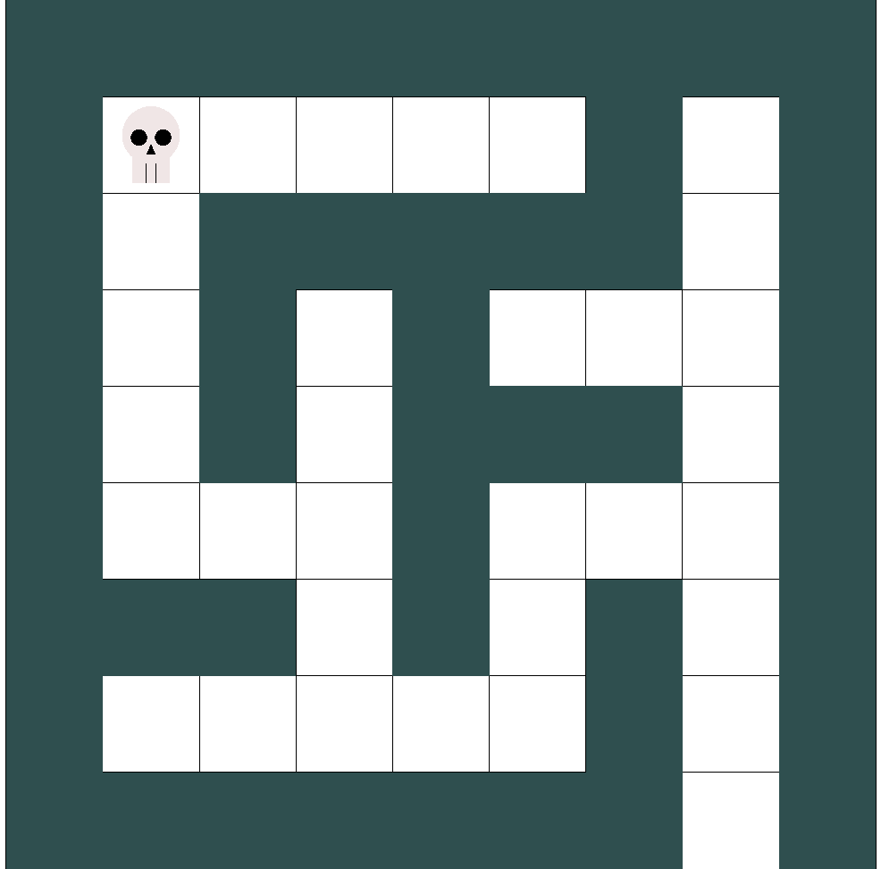

# labirinth_robot
The dumb, average and smart robots need to find their way through the labirith. Who will find the exit first?

This program uses the OpenGL libraries to ilustrate an interesting dilemma. Three robots must find their way through the labirinth. They are classified as Dumb, Average and Smart robots.

- **Dumb**: Moves randomly through the labirinth.
- **Average**: Every wall it finds, will turn to its right.
- **Smart**: Will move through the labirinth as if its left hand is always touching a wall.

  

The input for this program is the labirinth file. This file is customizable, but in this project, there are 2 initial models: labirinth.txt and biglabirinth.txt. These files are organized as:

```sh
dim X Y
robo R
pos X0 Y0
labirinth drawing
```

Where:
 - X and Y are the dimensions of the Labirinth matrix.
 - R is the robot type: 1 dumb, 2 average, 3 smart.
 - X0 and Y0 are the starting point of the robot.
 - The labirinth drawing is designed with spaces being empty spaces and * the walls. For example:
```sh
*********       
*     * *        
* ***** *
* * *   *
* * *** *
*   *   *
*** * * *
*     * *
******* *
```

Represents:<br \> 


### Compiling and Running

In order to compile and execute this program (linux), the Glut library must be properly installed. More instructions, click <a href="http://kiwwito.com/installing-opengl-glut-libraries-in-ubuntu/">here</a>. After that, you can follow the next steps.

Compiling: 
```sh
$ make all
```
Running:
```sh
$ ./projrobo labirinth.txt
```
