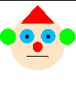

# labyrinth_robot
The dumb, average and smart robots need to find their way through the labyrinth. Who will find the exit first?

This program uses the OpenGL libraries to ilustrate an interesting dilemma. Three robots must find their way through the labyrinth. They are classified as Dumb, Average and Smart robots.

- **Dumb**: Moves randomly through the labyrinth.
- **Average**: Every wall it finds, will turn to its right.
- **Smart**: Will move through the labyrinth as if its left hand is always touching a wall.

  

The input for this program is the labyrinth file. This file is customizable, but in this project, there are 2 initial models: labyrinth.txt and biglabyrinth.txt. These files are organized as:

```sh
dim X Y
robo R
pos X0 Y0
labyrinth drawing
```

Where:
 - X and Y are the dimensions of the labyrinth matrix.
 - R is the robot type: 1 dumb, 2 average, 3 smart.
 - X0 and Y0 are the starting point of the robot.
 - The labyrinth drawing is designed with spaces being empty spaces and * the walls. For example:
```sh
*********       
*     * *        
* ***** *
* * *   *
* * *** *
*   *   *
*** * * *
*     * *
******* *
```

Represents:<br \> 


### Compiling and Running

In order to compile and execute this program (linux), the Glut library must be properly installed. More instructions, click <a href="http://kiwwito.com/installing-opengl-glut-libraries-in-ubuntu/">here</a>. After that, you can follow the next steps.

Compiling: 
```sh
$ make all
```
Running:
```sh
$ ./projrobo labyrinth.txt
```
